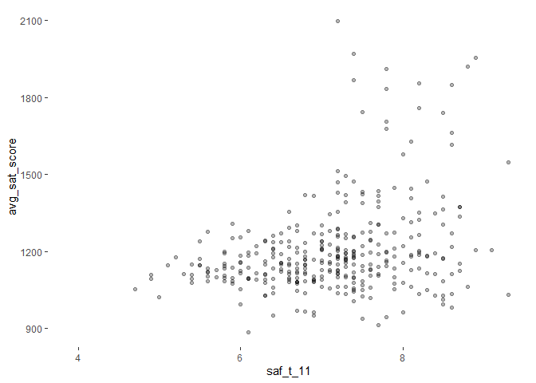
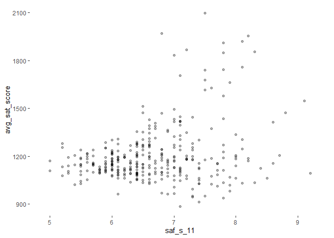
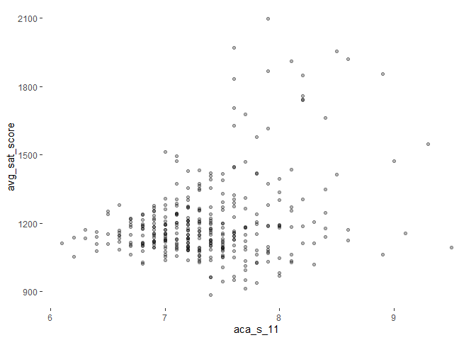
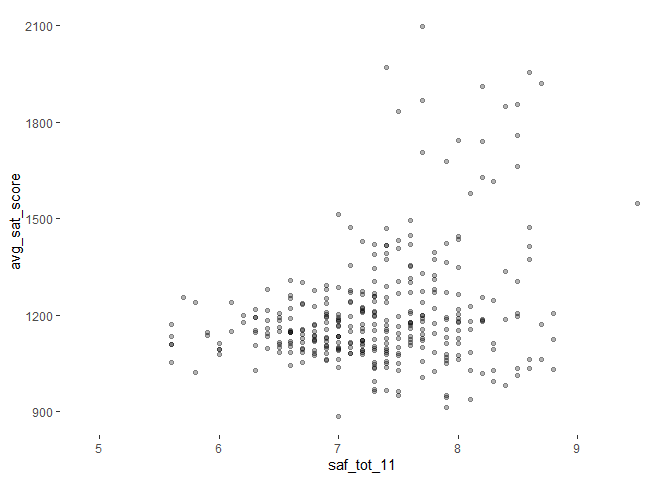
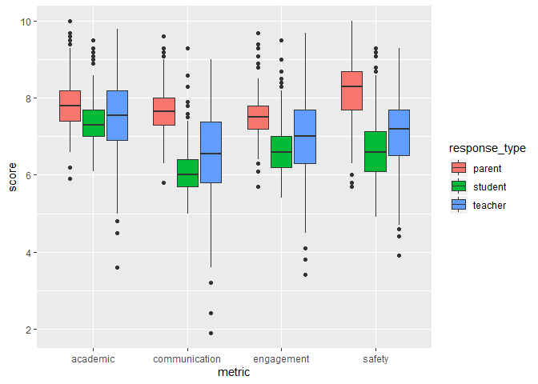

My Test R Markdown
================
AA
31/05/2020

The dataset is publicly available at: combined.csv:
<https://data.world/dataquest/nyc-schools-data/workspace/file?filename=combined.csv>
NYC school survey data for 2011:
<https://data.cityofnewyork.us/Education/2011-NYC-School-Survey/mnz3-dyi8>

We will try to answer the following questions:

Do student, teacher, and parent perceptions of NYC school quality appear
to be related to demographic and academic success metrics?

Do students, teachers, and parents have similar perceptions of NYC
school quality?

First, let’s load the required libraries:

``` r
library(readr)
library(dplyr)
```

    ## 
    ## Attaching package: 'dplyr'

    ## The following objects are masked from 'package:stats':
    ## 
    ##     filter, lag

    ## The following objects are masked from 'package:base':
    ## 
    ##     intersect, setdiff, setequal, union

``` r
library(purrr)
library(ggplot2)
library(stringr)
library(tidyr)
```

Let’s import the data that we cleaned from the previous courses.

``` r
combined <- read_csv("combined.csv")
```

    ## Parsed with column specification:
    ## cols(
    ##   .default = col_double(),
    ##   DBN = col_character(),
    ##   school_name = col_character(),
    ##   boro = col_character()
    ## )

    ## See spec(...) for full column specifications.

Next, we’ll import the survey data. The txt survey data is separated by
tabs so we will use read\_tsv() from the readr library to import the
files masterfile11\_gened\_final.txt and masterfile11\_d75\_final.txt

``` r
masterfile1_gened <- read_tsv("masterfile11_gened_final.txt")
```

    ## Parsed with column specification:
    ## cols(
    ##   .default = col_double(),
    ##   dbn = col_character(),
    ##   bn = col_character(),
    ##   schoolname = col_character(),
    ##   studentssurveyed = col_character(),
    ##   schooltype = col_character(),
    ##   p_q1 = col_logical(),
    ##   p_q3d = col_logical(),
    ##   p_q9 = col_logical(),
    ##   p_q10 = col_logical(),
    ##   p_q12aa = col_logical(),
    ##   p_q12ab = col_logical(),
    ##   p_q12ac = col_logical(),
    ##   p_q12ad = col_logical(),
    ##   p_q12ba = col_logical(),
    ##   p_q12bb = col_logical(),
    ##   p_q12bc = col_logical(),
    ##   p_q12bd = col_logical(),
    ##   t_q6m = col_logical(),
    ##   t_q9 = col_logical(),
    ##   t_q10a = col_logical()
    ##   # ... with 18 more columns
    ## )

    ## See spec(...) for full column specifications.

``` r
masterfile1_d75 <- read_tsv("masterfile11_d75_final.txt")
```

    ## Parsed with column specification:
    ## cols(
    ##   .default = col_double(),
    ##   dbn = col_character(),
    ##   bn = col_character(),
    ##   schoolname = col_character(),
    ##   studentssurveyed = col_character(),
    ##   schooltype = col_character(),
    ##   p_q5 = col_logical(),
    ##   p_q9 = col_logical(),
    ##   p_q13a = col_logical(),
    ##   p_q13b = col_logical(),
    ##   p_q13c = col_logical(),
    ##   p_q13d = col_logical(),
    ##   p_q14a = col_logical(),
    ##   p_q14b = col_logical(),
    ##   p_q14c = col_logical(),
    ##   p_q14d = col_logical(),
    ##   t_q11a = col_logical(),
    ##   t_q11b = col_logical(),
    ##   t_q14 = col_logical(),
    ##   t_q15a = col_logical(),
    ##   t_q15b = col_logical()
    ##   # ... with 14 more columns
    ## )
    ## See spec(...) for full column specifications.

Let’s check out the data that we’ve imported:

``` r
head(masterfile1_gened,5)
```

    ## # A tibble: 5 x 1,942
    ##   dbn   bn    schoolname   d75 studentssurveyed highschool schooltype  rr_s
    ##   <chr> <chr> <chr>      <dbl> <chr>                 <dbl> <chr>      <dbl>
    ## 1 01M0~ M015  P.S. 015 ~     0 No                        0 Elementar~    NA
    ## 2 01M0~ M019  P.S. 019 ~     0 No                        0 Elementar~    NA
    ## 3 01M0~ M020  P.S. 020 ~     0 No                        0 Elementar~    NA
    ## 4 01M0~ M034  P.S. 034 ~     0 Yes                       0 Elementar~    89
    ## 5 01M0~ M063  P.S. 063 ~     0 No                        0 Elementar~    NA
    ## # ... with 1,934 more variables: rr_t <dbl>, rr_p <dbl>, N_s <dbl>, N_t <dbl>,
    ## #   N_p <dbl>, nr_s <dbl>, nr_t <dbl>, nr_p <dbl>, saf_p_11 <dbl>,
    ## #   com_p_11 <dbl>, eng_p_11 <dbl>, aca_p_11 <dbl>, saf_t_11 <dbl>,
    ## #   com_t_11 <dbl>, eng_t_11 <dbl>, aca_t_11 <dbl>, saf_s_11 <dbl>,
    ## #   com_s_11 <dbl>, eng_s_11 <dbl>, aca_s_11 <dbl>, saf_tot_11 <dbl>,
    ## #   com_tot_11 <dbl>, eng_tot_11 <dbl>, aca_tot_11 <dbl>, p_q2h <dbl>,
    ## #   p_q7a <dbl>, p_q7b <dbl>, p_q7c <dbl>, p_q7d <dbl>, p_q8a <dbl>,
    ## #   p_q8b <dbl>, p_q8c <dbl>, p_q8d <dbl>, p_q8e <dbl>, p_q8f <dbl>,
    ## #   p_q2b <dbl>, p_q2d <dbl>, p_q2e <dbl>, p_q2f <dbl>, p_q2g <dbl>,
    ## #   p_q3a <dbl>, p_q3b <dbl>, p_q4b <dbl>, p_q4c <dbl>, p_q11c <dbl>,
    ## #   p_q2a <dbl>, p_q2c <dbl>, p_q3c <dbl>, p_q6a <dbl>, p_q6b <dbl>,
    ## #   p_q11d <dbl>, p_q11e <dbl>, p_q5 <dbl>, p_q4a <dbl>, p_q4d <dbl>,
    ## #   p_q4e <dbl>, p_q11a <dbl>, p_q11b <dbl>, p_q11f <dbl>, p_q1 <lgl>,
    ## #   p_q3d <lgl>, p_q9 <lgl>, p_q10 <lgl>, p_q12aa <lgl>, p_q12ab <lgl>,
    ## #   p_q12ac <lgl>, p_q12ad <lgl>, p_q12ba <lgl>, p_q12bb <lgl>, p_q12bc <lgl>,
    ## #   p_q12bd <lgl>, p_q1_1 <dbl>, p_q1_2 <dbl>, p_q1_3 <dbl>, p_q1_4 <dbl>,
    ## #   p_q1_5 <dbl>, p_q1_6 <dbl>, p_q1_7 <dbl>, p_q1_8 <dbl>, p_q1_9 <dbl>,
    ## #   p_q1_10 <dbl>, p_q1_11 <dbl>, p_q1_12 <dbl>, p_q1_13 <dbl>, p_q1_14 <dbl>,
    ## #   p_q2a_1 <dbl>, p_q2a_2 <dbl>, p_q2a_3 <dbl>, p_q2a_4 <dbl>, p_q2a_5 <dbl>,
    ## #   p_q2b_1 <dbl>, p_q2b_2 <dbl>, p_q2b_3 <dbl>, p_q2b_4 <dbl>, p_q2b_5 <dbl>,
    ## #   p_q2c_1 <dbl>, p_q2c_2 <dbl>, p_q2c_3 <dbl>, p_q2c_4 <dbl>, p_q2c_5 <dbl>,
    ## #   ...

``` r
head(masterfile1_d75,5)
```

    ## # A tibble: 5 x 1,773
    ##   dbn   bn    schoolname   d75 studentssurveyed highschool schooltype  rr_s
    ##   <chr> <chr> <chr>      <dbl> <chr>                 <dbl> <chr>      <dbl>
    ## 1 75K0~ K004  P.S. K004      1 Yes                       0 District ~    38
    ## 2 75K0~ K036  P.S. 36        1 Yes                      NA District ~    70
    ## 3 75K0~ K053  P.S. K053      1 Yes                      NA District ~    94
    ## 4 75K0~ K077  P.S. K077      1 Yes                      NA District ~    95
    ## 5 75K1~ K140  P.S. K140      1 Yes                       0 District ~    77
    ## # ... with 1,765 more variables: rr_t <dbl>, rr_p <dbl>, N_s <dbl>, N_t <dbl>,
    ## #   N_p <dbl>, nr_s <dbl>, nr_t <dbl>, nr_p <dbl>, saf_p_11 <dbl>,
    ## #   com_p_11 <dbl>, eng_p_11 <dbl>, aca_p_11 <dbl>, saf_t_11 <dbl>,
    ## #   com_t_11 <dbl>, eng_t_11 <dbl>, aca_t_11 <dbl>, saf_s_11 <dbl>,
    ## #   com_s_11 <dbl>, eng_s_11 <dbl>, aca_s_11 <dbl>, saf_tot_11 <dbl>,
    ## #   com_tot_11 <dbl>, eng_tot_11 <dbl>, aca_tot_11 <dbl>, p_q1c <dbl>,
    ## #   p_q10a <dbl>, p_q10b <dbl>, p_q10c <dbl>, p_q10d <dbl>, p_q10e <dbl>,
    ## #   p_q10f <dbl>, p_q11a <dbl>, p_q11b <dbl>, p_q11c <dbl>, p_q11d <dbl>,
    ## #   p_q11e <dbl>, p_q1b <dbl>, p_q1e <dbl>, p_q1f <dbl>, p_q2a <dbl>,
    ## #   p_q2b <dbl>, p_q3c <dbl>, p_q3d <dbl>, p_q4a <dbl>, p_q6c <dbl>,
    ## #   p_q12c <dbl>, p_q1a <dbl>, p_q1d <dbl>, p_q3a <dbl>, p_q3b <dbl>,
    ## #   p_q3e <dbl>, p_q4b <dbl>, p_q4c <dbl>, p_q6e <dbl>, p_q7 <dbl>,
    ## #   p_q8a <dbl>, p_q8b <dbl>, p_q12d <dbl>, p_q1g <dbl>, p_q6a <dbl>,
    ## #   p_q6b <dbl>, p_q6d <dbl>, p_q6f <dbl>, p_q6g <dbl>, p_q6h <dbl>,
    ## #   p_q12a <dbl>, p_q12b <dbl>, p_q12e <dbl>, p_q12f <dbl>, p_q5 <lgl>,
    ## #   p_q9 <lgl>, p_q13a <lgl>, p_q13b <lgl>, p_q13c <lgl>, p_q13d <lgl>,
    ## #   p_q14a <lgl>, p_q14b <lgl>, p_q14c <lgl>, p_q14d <lgl>, p_q1a_1 <dbl>,
    ## #   p_q1a_2 <dbl>, p_q1a_3 <dbl>, p_q1a_4 <dbl>, p_q1a_5 <dbl>, p_q1b_1 <dbl>,
    ## #   p_q1b_2 <dbl>, p_q1b_3 <dbl>, p_q1b_4 <dbl>, p_q1b_5 <dbl>, p_q1c_1 <dbl>,
    ## #   p_q1c_2 <dbl>, p_q1c_3 <dbl>, p_q1c_4 <dbl>, p_q1c_5 <dbl>, p_q1d_1 <dbl>,
    ## #   p_q1d_2 <dbl>, p_q1d_3 <dbl>, p_q1d_4 <dbl>, p_q1d_5 <dbl>, p_q1e_1 <dbl>,
    ## #   ...

We can see that the dataframes contain columns that are not relevant to
our analysis. Let’s create a dataframe by selecting only the relevant
columns.

``` r
gened <- masterfile1_gened %>%
  filter(schooltype == "High School") %>%
  select(DBN = dbn, schoolname, rr_s:aca_tot_11)

head(gened,5)
```

    ## # A tibble: 5 x 27
    ##   DBN   schoolname  rr_s  rr_t  rr_p   N_s   N_t   N_p  nr_s  nr_t  nr_p
    ##   <chr> <chr>      <dbl> <dbl> <dbl> <dbl> <dbl> <dbl> <dbl> <dbl> <dbl>
    ## 1 01M4~ Universit~    84    95    10   385    37    46   459    39   445
    ## 2 01M4~ Forsyth S~    40   100    23    66    10    37   167    10   164
    ## 3 01M5~ Marta Val~    90   100    21   306    29    69   339    28   325
    ## 4 01M5~ Lower Eas~    95   100    86   454    36   389   477    36   450
    ## 5 01M6~ Cascades ~    75    86    19   125    12    30   166    14   158
    ## # ... with 16 more variables: saf_p_11 <dbl>, com_p_11 <dbl>, eng_p_11 <dbl>,
    ## #   aca_p_11 <dbl>, saf_t_11 <dbl>, com_t_11 <dbl>, eng_t_11 <dbl>,
    ## #   aca_t_11 <dbl>, saf_s_11 <dbl>, com_s_11 <dbl>, eng_s_11 <dbl>,
    ## #   aca_s_11 <dbl>, saf_tot_11 <dbl>, com_tot_11 <dbl>, eng_tot_11 <dbl>,
    ## #   aca_tot_11 <dbl>

Next, we’ll simplify the d75 dataframe.

``` r
d75 <- masterfile1_d75 %>%
  select(DBN=dbn,schoolname,studentssurveyed:aca_tot_11)

head(d75,5)
```

    ## # A tibble: 5 x 30
    ##   DBN   schoolname studentssurveyed highschool schooltype  rr_s  rr_t  rr_p
    ##   <chr> <chr>      <chr>                 <dbl> <chr>      <dbl> <dbl> <dbl>
    ## 1 75K0~ P.S. K004  Yes                       0 District ~    38    90    72
    ## 2 75K0~ P.S. 36    Yes                      NA District ~    70    69    44
    ## 3 75K0~ P.S. K053  Yes                      NA District ~    94    97    53
    ## 4 75K0~ P.S. K077  Yes                      NA District ~    95    65    55
    ## 5 75K1~ P.S. K140  Yes                       0 District ~    77    70    42
    ## # ... with 22 more variables: N_s <dbl>, N_t <dbl>, N_p <dbl>, nr_s <dbl>,
    ## #   nr_t <dbl>, nr_p <dbl>, saf_p_11 <dbl>, com_p_11 <dbl>, eng_p_11 <dbl>,
    ## #   aca_p_11 <dbl>, saf_t_11 <dbl>, com_t_11 <dbl>, eng_t_11 <dbl>,
    ## #   aca_t_11 <dbl>, saf_s_11 <dbl>, com_s_11 <dbl>, eng_s_11 <dbl>,
    ## #   aca_s_11 <dbl>, saf_tot_11 <dbl>, com_tot_11 <dbl>, eng_tot_11 <dbl>,
    ## #   aca_tot_11 <dbl>

We can now combine the gened and d75 dataframes as we have scaled down
the number of columns.

``` r
survey <- bind_rows(gened,d75)

survey
```

    ## # A tibble: 439 x 30
    ##    DBN   schoolname  rr_s  rr_t  rr_p   N_s   N_t   N_p  nr_s  nr_t  nr_p
    ##    <chr> <chr>      <dbl> <dbl> <dbl> <dbl> <dbl> <dbl> <dbl> <dbl> <dbl>
    ##  1 01M4~ Universit~    84    95    10   385    37    46   459    39   445
    ##  2 01M4~ Forsyth S~    40   100    23    66    10    37   167    10   164
    ##  3 01M5~ Marta Val~    90   100    21   306    29    69   339    28   325
    ##  4 01M5~ Lower Eas~    95   100    86   454    36   389   477    36   450
    ##  5 01M6~ Cascades ~    75    86    19   125    12    30   166    14   158
    ##  6 01M6~ Bard High~    98    81    50   561    30   283   571    37   561
    ##  7 02M0~ 47 The Am~    72    76    30   109    16    43   152    21   145
    ##  8 02M2~ Food and ~    86   100    57   348    35   229   407    31   405
    ##  9 02M2~ Essex Str~    48    56     9   150    15    28   314    27   306
    ## 10 02M2~ High Scho~    61    96    56   233    27   204   385    28   365
    ## # ... with 429 more rows, and 19 more variables: saf_p_11 <dbl>,
    ## #   com_p_11 <dbl>, eng_p_11 <dbl>, aca_p_11 <dbl>, saf_t_11 <dbl>,
    ## #   com_t_11 <dbl>, eng_t_11 <dbl>, aca_t_11 <dbl>, saf_s_11 <dbl>,
    ## #   com_s_11 <dbl>, eng_s_11 <dbl>, aca_s_11 <dbl>, saf_tot_11 <dbl>,
    ## #   com_tot_11 <dbl>, eng_tot_11 <dbl>, aca_tot_11 <dbl>,
    ## #   studentssurveyed <chr>, highschool <dbl>, schooltype <chr>

Let’s combine the survey dataframe with our combined df using left join
so that we can retain all observations in the combined df and those
matching records in the survey df.The key for our join is the DBN
variable which exists in all our dataframes.

``` r
combinedsurvey <- combined %>%
  left_join(survey, by = "DBN")

combinedsurvey
```

    ## # A tibble: 479 x 59
    ##    DBN   school_name `Num of SAT Tes~ `SAT Critical R~ `SAT Math Avg. ~
    ##    <chr> <chr>                  <dbl>            <dbl>            <dbl>
    ##  1 01M2~ HENRY STRE~               29              355              404
    ##  2 01M4~ UNIVERSITY~               91              383              423
    ##  3 01M4~ EAST SIDE ~               70              377              402
    ##  4 01M4~ FORSYTH SA~                7              414              401
    ##  5 01M5~ MARTA VALL~               44              390              433
    ##  6 01M5~ LOWER EAST~              112              332              557
    ##  7 01M5~ NEW EXPLOR~              159              522              574
    ##  8 01M6~ CASCADES H~               18              417              418
    ##  9 01M6~ BARD HIGH ~              130              624              604
    ## 10 02M0~ 47 THE AME~               16              395              400
    ## # ... with 469 more rows, and 54 more variables: `SAT Writing Avg.
    ## #   Score` <dbl>, avg_sat_score <dbl>, `AP Test Takers` <dbl>, `Total Exams
    ## #   Taken` <dbl>, `Number of Exams with scores 3 4 or 5` <dbl>,
    ## #   exams_per_student <dbl>, high_score_percent <dbl>, avg_class_size <dbl>,
    ## #   frl_percent <dbl>, total_enrollment <dbl>, ell_percent <dbl>,
    ## #   sped_percent <dbl>, selfcontained_num <dbl>, asian_per <dbl>,
    ## #   black_per <dbl>, hispanic_per <dbl>, white_per <dbl>, male_per <dbl>,
    ## #   female_per <dbl>, `Total Cohort` <dbl>, grads_percent <dbl>,
    ## #   dropout_percent <dbl>, boro <chr>, lat <dbl>, long <dbl>, schoolname <chr>,
    ## #   rr_s <dbl>, rr_t <dbl>, rr_p <dbl>, N_s <dbl>, N_t <dbl>, N_p <dbl>,
    ## #   nr_s <dbl>, nr_t <dbl>, nr_p <dbl>, saf_p_11 <dbl>, com_p_11 <dbl>,
    ## #   eng_p_11 <dbl>, aca_p_11 <dbl>, saf_t_11 <dbl>, com_t_11 <dbl>,
    ## #   eng_t_11 <dbl>, aca_t_11 <dbl>, saf_s_11 <dbl>, com_s_11 <dbl>,
    ## #   eng_s_11 <dbl>, aca_s_11 <dbl>, saf_tot_11 <dbl>, com_tot_11 <dbl>,
    ## #   eng_tot_11 <dbl>, aca_tot_11 <dbl>, studentssurveyed <chr>,
    ## #   highschool <dbl>, schooltype <chr>

Let’s look for relationships between variables by creating a correlation
marix.

``` r
corr_mat <- combinedsurvey %>%    
  select(avg_sat_score, saf_p_11:aca_tot_11) %>%
  cor(use = "pairwise.complete.obs")

corr_mat
```

    ##               avg_sat_score   saf_p_11   com_p_11  eng_p_11    aca_p_11
    ## avg_sat_score   1.000000000 0.08913424 -0.1139639 0.0094307 0.008276863
    ## saf_p_11        0.089134237 1.00000000  0.8029932 0.7984741 0.817219807
    ## com_p_11       -0.113963937 0.80299315  1.0000000 0.9291268 0.925565838
    ## eng_p_11        0.009430700 0.79847408  0.9291268 1.0000000 0.907884041
    ## aca_p_11        0.008276863 0.81721981  0.9255658 0.9078840 1.000000000
    ## saf_t_11        0.309144422 0.49046519  0.3149366 0.3392305 0.415400554
    ## com_t_11        0.107470334 0.23164622  0.2411942 0.2675333 0.285824766
    ## eng_t_11        0.056125707 0.31403333  0.3071861 0.3296697 0.373418577
    ## aca_t_11        0.141157527 0.36423106  0.3470251 0.3585188 0.419085881
    ## saf_s_11        0.277268115 0.73241477  0.5411576 0.5390565 0.593038790
    ## com_s_11        0.162302236 0.61691582  0.5687691 0.5450478 0.598092320
    ## eng_s_11        0.170346019 0.64749568  0.5913392 0.6075781 0.622737241
    ## aca_s_11        0.292587986 0.69197352  0.6146925 0.6236426 0.679837302
    ## saf_tot_11      0.276041045 0.82764669  0.6105585 0.6209748 0.682848168
    ## com_tot_11      0.089098561 0.64231997  0.6933924 0.6820356 0.711988528
    ## eng_tot_11      0.094794066 0.66370163  0.6714581 0.7101096 0.720034872
    ## aca_tot_11      0.173800408 0.70043795  0.7028261 0.7054661 0.789215088
    ##                saf_t_11  com_t_11   eng_t_11  aca_t_11  saf_s_11  com_s_11
    ## avg_sat_score 0.3091444 0.1074703 0.05612571 0.1411575 0.2772681 0.1623022
    ## saf_p_11      0.4904652 0.2316462 0.31403333 0.3642311 0.7324148 0.6169158
    ## com_p_11      0.3149366 0.2411942 0.30718612 0.3470251 0.5411576 0.5687691
    ## eng_p_11      0.3392305 0.2675333 0.32966966 0.3585188 0.5390565 0.5450478
    ## aca_p_11      0.4154006 0.2858248 0.37341858 0.4190859 0.5930388 0.5980923
    ## saf_t_11      1.0000000 0.7437526 0.79946285 0.8448628 0.5922487 0.3825288
    ## com_t_11      0.7437526 1.0000000 0.90329649 0.8960927 0.2527900 0.1683019
    ## eng_t_11      0.7994629 0.9032965 1.00000000 0.9498147 0.3678941 0.2887301
    ## aca_t_11      0.8448628 0.8960927 0.94981468 1.0000000 0.4186507 0.3239221
    ## saf_s_11      0.5922487 0.2527900 0.36789407 0.4186507 1.0000000 0.8227886
    ## com_s_11      0.3825288 0.1683019 0.28873011 0.3239221 0.8227886 1.0000000
    ## eng_s_11      0.4565140 0.2585602 0.35784213 0.3881175 0.8847919 0.8836172
    ## aca_s_11      0.4932720 0.2652035 0.35936021 0.4089070 0.8719545 0.8649279
    ## saf_tot_11    0.8435345 0.5074542 0.60846241 0.6660397 0.8908945 0.6907220
    ## com_tot_11    0.7363689 0.7997233 0.80356551 0.8236332 0.6412669 0.6575138
    ## eng_tot_11    0.7568738 0.7214690 0.83787593 0.8276065 0.7078967 0.6591503
    ## aca_tot_11    0.7817245 0.6943313 0.78680846 0.8445192 0.7142941 0.6597831
    ##                eng_s_11  aca_s_11 saf_tot_11 com_tot_11 eng_tot_11 aca_tot_11
    ## avg_sat_score 0.1703460 0.2925880  0.2760410 0.08909856 0.09479407  0.1738004
    ## saf_p_11      0.6474957 0.6919735  0.8276467 0.64231997 0.66370163  0.7004380
    ## com_p_11      0.5913392 0.6146925  0.6105585 0.69339241 0.67145808  0.7028261
    ## eng_p_11      0.6075781 0.6236426  0.6209748 0.68203559 0.71010958  0.7054661
    ## aca_p_11      0.6227372 0.6798373  0.6828482 0.71198853 0.72003487  0.7892151
    ## saf_t_11      0.4565140 0.4932720  0.8435345 0.73636889 0.75687379  0.7817245
    ## com_t_11      0.2585602 0.2652035  0.5074542 0.79972327 0.72146902  0.6943313
    ## eng_t_11      0.3578421 0.3593602  0.6084624 0.80356551 0.83787593  0.7868085
    ## aca_t_11      0.3881175 0.4089070  0.6660397 0.82363320 0.82760652  0.8445192
    ## saf_s_11      0.8847919 0.8719545  0.8908945 0.64126689 0.70789667  0.7142941
    ## com_s_11      0.8836172 0.8649279  0.6907220 0.65751381 0.65915031  0.6597831
    ## eng_s_11      1.0000000 0.9213798  0.7573247 0.68395614 0.75920793  0.7208915
    ## aca_s_11      0.9213798 1.0000000  0.7855468 0.69009358 0.73953389  0.7778084
    ## saf_tot_11    0.7573247 0.7855468  1.0000000 0.79013553 0.83403143  0.8601577
    ## com_tot_11    0.6839561 0.6900936  0.7901355 1.00000000 0.93995349  0.9317467
    ## eng_tot_11    0.7592079 0.7395339  0.8340314 0.93995349 1.00000000  0.9525649
    ## aca_tot_11    0.7208915 0.7778084  0.8601577 0.93174674 0.95256492  1.0000000

Convert matrix to tibble to allow for easier interpretation.

``` r
corr_tibble <- corr_mat %>%
  as_tibble(rownames = "variable")

corr_tibble
```

    ## # A tibble: 17 x 18
    ##    variable avg_sat_score saf_p_11 com_p_11 eng_p_11 aca_p_11 saf_t_11 com_t_11
    ##    <chr>            <dbl>    <dbl>    <dbl>    <dbl>    <dbl>    <dbl>    <dbl>
    ##  1 avg_sat~       1         0.0891   -0.114  0.00943  0.00828    0.309    0.107
    ##  2 saf_p_11       0.0891    1         0.803  0.798    0.817      0.490    0.232
    ##  3 com_p_11      -0.114     0.803     1      0.929    0.926      0.315    0.241
    ##  4 eng_p_11       0.00943   0.798     0.929  1        0.908      0.339    0.268
    ##  5 aca_p_11       0.00828   0.817     0.926  0.908    1          0.415    0.286
    ##  6 saf_t_11       0.309     0.490     0.315  0.339    0.415      1        0.744
    ##  7 com_t_11       0.107     0.232     0.241  0.268    0.286      0.744    1    
    ##  8 eng_t_11       0.0561    0.314     0.307  0.330    0.373      0.799    0.903
    ##  9 aca_t_11       0.141     0.364     0.347  0.359    0.419      0.845    0.896
    ## 10 saf_s_11       0.277     0.732     0.541  0.539    0.593      0.592    0.253
    ## 11 com_s_11       0.162     0.617     0.569  0.545    0.598      0.383    0.168
    ## 12 eng_s_11       0.170     0.647     0.591  0.608    0.623      0.457    0.259
    ## 13 aca_s_11       0.293     0.692     0.615  0.624    0.680      0.493    0.265
    ## 14 saf_tot~       0.276     0.828     0.611  0.621    0.683      0.844    0.507
    ## 15 com_tot~       0.0891    0.642     0.693  0.682    0.712      0.736    0.800
    ## 16 eng_tot~       0.0948    0.664     0.671  0.710    0.720      0.757    0.721
    ## 17 aca_tot~       0.174     0.700     0.703  0.705    0.789      0.782    0.694
    ## # ... with 10 more variables: eng_t_11 <dbl>, aca_t_11 <dbl>, saf_s_11 <dbl>,
    ## #   com_s_11 <dbl>, eng_s_11 <dbl>, aca_s_11 <dbl>, saf_tot_11 <dbl>,
    ## #   com_tot_11 <dbl>, eng_tot_11 <dbl>, aca_tot_11 <dbl>

Filter for strong correlations bet `avg_sat_score` and other variables:
greater than 0.25 or less than -0.25

``` r
strong_cor <- corr_tibble %>%
  select(variable, avg_sat_score) %>%
  filter(avg_sat_score > 0.25 | avg_sat_score < -0.25)

strong_cor
```

    ## # A tibble: 5 x 2
    ##   variable      avg_sat_score
    ##   <chr>                 <dbl>
    ## 1 avg_sat_score         1    
    ## 2 saf_t_11              0.309
    ## 3 saf_s_11              0.277
    ## 4 aca_s_11              0.293
    ## 5 saf_tot_11            0.276

Create scatterplots to visualize relationships.

``` r
#create a function to efficiently create scatterplots
scattergen <- function(x,y) {
  ggplot(data=combinedsurvey) +
    aes_string(x = x,y = y) +
    geom_point(alpha=0.3) +
    theme(panel.background = element_rect(fill = "white"))
}

strong_cor$variable
```

    ## [1] "avg_sat_score" "saf_t_11"      "saf_s_11"      "aca_s_11"     
    ## [5] "saf_tot_11"

``` r
y_var = strong_cor$variable[1]
x_var = strong_cor$variable[2:5]

y_var
```

    ## [1] "avg_sat_score"

``` r
x_var
```

    ## [1] "saf_t_11"   "saf_s_11"   "aca_s_11"   "saf_tot_11"

``` r
map2(x_var,y_var,scattergen)
```

    ## [[1]]

    ## Warning: Removed 137 rows containing missing values (geom_point).

<!-- -->

    ## 
    ## [[2]]

    ## Warning: Removed 139 rows containing missing values (geom_point).

<!-- -->

    ## 
    ## [[3]]

    ## Warning: Removed 139 rows containing missing values (geom_point).

<!-- -->

    ## 
    ## [[4]]

    ## Warning: Removed 137 rows containing missing values (geom_point).

<!-- -->

From the scatterplots, we can see that there is a positive relationship
between avg\_sat\_score and saf\_t\_11 (Safety and Respect score based
on teacher responses), saf\_s\_11(safety and respect score based on
student responses), aca\_s\_11 (academic expectations score based on
student responses) and saf\_tot\_11 (safety and respect total score).

Our next step is to reshape the data with the so that the survey
question (e.g., saf\_p\_11) and the corresponding score are in two
separate columns:

``` r
combinedlong <- combinedsurvey %>%
  pivot_longer(cols = c(saf_p_11:aca_tot_11), names_to = "survey_question", values_to = "score" )

combinedlong
```

    ## # A tibble: 7,664 x 45
    ##    DBN   school_name `Num of SAT Tes~ `SAT Critical R~ `SAT Math Avg. ~
    ##    <chr> <chr>                  <dbl>            <dbl>            <dbl>
    ##  1 01M2~ HENRY STRE~               29              355              404
    ##  2 01M2~ HENRY STRE~               29              355              404
    ##  3 01M2~ HENRY STRE~               29              355              404
    ##  4 01M2~ HENRY STRE~               29              355              404
    ##  5 01M2~ HENRY STRE~               29              355              404
    ##  6 01M2~ HENRY STRE~               29              355              404
    ##  7 01M2~ HENRY STRE~               29              355              404
    ##  8 01M2~ HENRY STRE~               29              355              404
    ##  9 01M2~ HENRY STRE~               29              355              404
    ## 10 01M2~ HENRY STRE~               29              355              404
    ## # ... with 7,654 more rows, and 40 more variables: `SAT Writing Avg.
    ## #   Score` <dbl>, avg_sat_score <dbl>, `AP Test Takers` <dbl>, `Total Exams
    ## #   Taken` <dbl>, `Number of Exams with scores 3 4 or 5` <dbl>,
    ## #   exams_per_student <dbl>, high_score_percent <dbl>, avg_class_size <dbl>,
    ## #   frl_percent <dbl>, total_enrollment <dbl>, ell_percent <dbl>,
    ## #   sped_percent <dbl>, selfcontained_num <dbl>, asian_per <dbl>,
    ## #   black_per <dbl>, hispanic_per <dbl>, white_per <dbl>, male_per <dbl>,
    ## #   female_per <dbl>, `Total Cohort` <dbl>, grads_percent <dbl>,
    ## #   dropout_percent <dbl>, boro <chr>, lat <dbl>, long <dbl>, schoolname <chr>,
    ## #   rr_s <dbl>, rr_t <dbl>, rr_p <dbl>, N_s <dbl>, N_t <dbl>, N_p <dbl>,
    ## #   nr_s <dbl>, nr_t <dbl>, nr_p <dbl>, studentssurveyed <chr>,
    ## #   highschool <dbl>, schooltype <chr>, survey_question <chr>, score <dbl>

Next, we will create a new variable to indicate the different response
types for parent, teacher, student and total.We will call this variable
response\_type. We will also create a new variable “metric” which is
also derived from the survey\_question variable.

``` r
combinedlong <-  combinedlong %>%
  mutate(response_type = ifelse(substr(survey_question,4,6) == "_p_", "parent",
                                ifelse(substr(survey_question,4,6) == "_s_", "student",
                                       ifelse(substr(survey_question,4,6) == "_t_", "teacher",
                                              ifelse(substr(survey_question,4,6) == "_to","total", "NA"))))) %>%
  mutate(metric = ifelse(substr(survey_question,1,3) == "eng", "engagement",
                         ifelse(substr(survey_question,1,3) == "aca", "academic",
                                ifelse(substr(survey_question,1,3) == "saf", "safety", "communication"))))

combinedlong
```

    ## # A tibble: 7,664 x 47
    ##    DBN   school_name `Num of SAT Tes~ `SAT Critical R~ `SAT Math Avg. ~
    ##    <chr> <chr>                  <dbl>            <dbl>            <dbl>
    ##  1 01M2~ HENRY STRE~               29              355              404
    ##  2 01M2~ HENRY STRE~               29              355              404
    ##  3 01M2~ HENRY STRE~               29              355              404
    ##  4 01M2~ HENRY STRE~               29              355              404
    ##  5 01M2~ HENRY STRE~               29              355              404
    ##  6 01M2~ HENRY STRE~               29              355              404
    ##  7 01M2~ HENRY STRE~               29              355              404
    ##  8 01M2~ HENRY STRE~               29              355              404
    ##  9 01M2~ HENRY STRE~               29              355              404
    ## 10 01M2~ HENRY STRE~               29              355              404
    ## # ... with 7,654 more rows, and 42 more variables: `SAT Writing Avg.
    ## #   Score` <dbl>, avg_sat_score <dbl>, `AP Test Takers` <dbl>, `Total Exams
    ## #   Taken` <dbl>, `Number of Exams with scores 3 4 or 5` <dbl>,
    ## #   exams_per_student <dbl>, high_score_percent <dbl>, avg_class_size <dbl>,
    ## #   frl_percent <dbl>, total_enrollment <dbl>, ell_percent <dbl>,
    ## #   sped_percent <dbl>, selfcontained_num <dbl>, asian_per <dbl>,
    ## #   black_per <dbl>, hispanic_per <dbl>, white_per <dbl>, male_per <dbl>,
    ## #   female_per <dbl>, `Total Cohort` <dbl>, grads_percent <dbl>,
    ## #   dropout_percent <dbl>, boro <chr>, lat <dbl>, long <dbl>, schoolname <chr>,
    ## #   rr_s <dbl>, rr_t <dbl>, rr_p <dbl>, N_s <dbl>, N_t <dbl>, N_p <dbl>,
    ## #   nr_s <dbl>, nr_t <dbl>, nr_p <dbl>, studentssurveyed <chr>,
    ## #   highschool <dbl>, schooltype <chr>, survey_question <chr>, score <dbl>,
    ## #   response_type <chr>, metric <chr>

Let’s visualize the differences between the responses of parents,
teachers and students with respect to the metric:

``` r
vizdata <- combinedlong %>%
  filter(response_type != "total")

ggplot(data=vizdata) +
  aes(x=metric, y=score, fill = response_type) +
  geom_boxplot()
```

    ## Warning: Removed 1268 rows containing non-finite values (stat_boxplot).

<!-- -->
